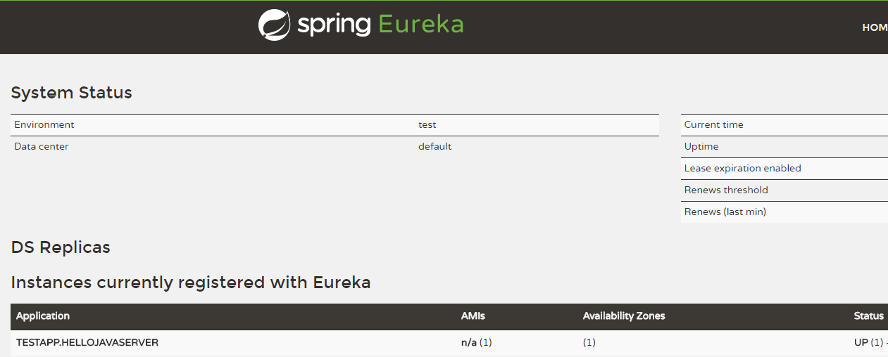

# Tars Java-Spring Cloud Integration instructions

## Function description

​Tars-java is compatible with the Spring Cloud system, users can integrate the Tars-java into Spring Cloud.
## Environmental dependence

​The following requirements should be met before operation.

- JDK 1.8 or above.

- If you want to use the discovery feature, you need an Eureka Server instance that has already run Spring Cloud. For details on how to start the configuration, please refer to the Spring Cloud related tutorial.

## Service release

Here are the steps to create and publish a service:

- First, create a maven project and add dependency configuration to the project's pom.xml:

```xml
<dependency>
    <groupId>com.tencent.tars</groupId>
    <artifactId>tars-spring-cloud-starter</artifactId>
    <version>1.6.2</version>
</dependency>
```

- Write the Tars file and generate the server interface code. For the specific operation process, please refer to the service development part of the tars_java_quickstart.md document:

```java
@Servant
public interface HelloServant {

	public String hello(int no, String name);          
}
```

- After the interface code is generated, the interface needs to be implemented. Then add the @TarsServant annotation to the entire implementation class, indicating that the modified class is a Tars Servant, don't forget to identify the Servant name in the annotation as the client calls the Servant identifier. According to the Tars specification, the servant name should end with "Obj":

```java
@TarsServant(name="HelloObj")
public class HelloServantImpl implements HelloServant {

    @Override
    public String hello(int no, String name) {
        return String.format("hello no=%s, name=%s, time=%s", no, name,     System.currentTimeMillis());
    }
}
```

- Write the startup-class of service, using the spring boot startup method, and indicate that this is a Tars-java service by annotating @EnableTarsConfiguration and try to register the service into the Spring Cloud:

```java
@SpringBootApplication
@EnableTarsConfiguration
public class Application {


    public static void main(String[] args) {
        SpringApplication.run(Application.class, args);
    }
}
```
- To write a Spring Cloud configuration file, you need to specify the address of the service registry and the information of the service itself in the configuration file. Create the configuration file application.yml in the resources directory. The example is as follows:

```yml
eureka:
  client:
    serviceUrl:
      #Service registry address
	  defaultZone: http://localhost:8761/eureka/

#The configuration under this tab is unique to Tars-java
tars:    
  #Server configuration
  server:
    #Server port
    port: 18601 
    #Application name, The specific meaning refers to the service naming chapter of tars_java_quickstart.md
    application: TestApp
    #Server name, The specific meaning refers to the service naming chapter of tars_java_quickstart.md
    server-name: HelloJavaServer
    #Specify the service log path, whichever is the case
    log-path: /usr/local/tars-eureka-test/bin/log
    #Specify data file path, whichever is the case
    data-path: /usr/local/tars-eureka-test/data
  #Client configuration
  client:
    async-invoke-timeout: 10000
    #Service discovery center address, generally the same as the registration center address, can be left blank
    locator: http://localhost:8761/eureka/
```
- Start the Application class, open the registry address [http://localhost:8761](http://localhost:8761/)(Based on your actual situation, this is the default address of Eureka), you can see that the Tars service is already registered on Eureka:



 TESTAPP.HELLOJAVASERVER is the service we just registered, where TESTAPP corresponds to the application name in the configuration file(attributes corresponding to tars.server.application), HELLOJAVASERVER corresponds to the server name in the configuration file(attributes corresponding to tars.server.server-name). The name registered on Eureka is the application name of the configuration file plus the service name, separated by a '.'. The service name displayed on the Eureka page is all uppercase, but it is actually the name filled in our configuration file.
 Eureka.

So far, a service has been developed.

## Access service

Here's how to discover and access a service.

- First create a maven project and add the following dependency configuration to the project's pom.xml file:

```xml
<dependency>
    <groupId>com.tencent.tars</groupId>
    <artifactId>tars-spring-cloud-starter</artifactId>
    <version>1.6.2</version>
</dependency>
```


- Use the Tars file on the server to generate the client access interface. For details, refer to the client development part of the tars_java_quickstart.md file:


```java
@Servant
public interface HelloPrx {

	public String hello(int no, String name);

	public String hello(int no, String name, @TarsContext java.util.Map<String, String> ctx);

	public void async_hello(@TarsCallback HelloPrxCallback callback, int no, String name);

	public void async_hello(@TarsCallback HelloPrxCallback callback, int no, String name, @TarsContext java.util.Map<String, String> ctx);
}
```

- Write a startup class that uses spring boot as the startup method:

```java
@SpringBootApplication
public class Application {
    public static void main(String[] args) {
        SpringApplication.run(Application.class, args);
        //use service...
    }
}
```

- Write the configuration file application.yml and add the master related information:

```
eureka:
  client:
    serviceUrl:
      #Service center address
      defaultZone: http://localhost:8761/eureka/
      #The client does not need to register with the spring cloud master
      register-with-eureka: false
```

  ​

- By annotating @TarsClient to make the system automatically load clients to access the interface, you need to specify the name of the Obj object to be accessed by the name attribute of the annotation. The name consists of the application name + "." + service name + "." + servant name. The name in the example is the servant registered by the service above. The class holding the variable needs to be registered as a spring bean

```java
@Component
public class Client {
    @TarsClient(name = "TestApp.HelloJavaServer.HelloObj")
    private HelloPrx proxy;
}
```

- Call target method


```java
proxy.hello(10, "hello");
```

